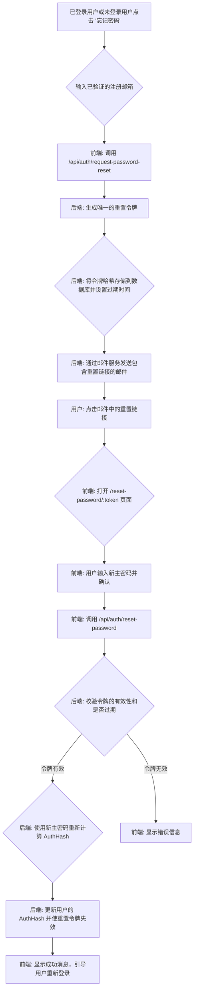

# EasyPassword 前端开发任务清单

本文档根据 `EasyPassword.md` 中的总体设计方案，为前端开发团队规划了详细的任务清单。

## 阶段一：MVP (最小可行产品) - 核心功能实现

目标：构建应用的核心骨架，实现端到端加密的密码管理闭环。

- [x] **1. 项目初始化与基础设置**
    - [x] 使用 Vite 初始化 Vue 3 + TypeScript 项目。
    - [x] 集成 Naive UI (或 Element Plus) 作为 UI 组件库。
    - [x] 配置 ESLint, Prettier, 和 EditorConfig 以确保代码规范。
    - [x] 搭建 `EasyPassword.md` 中建议的项目目录结构 (`/api`, `/components`, `/crypto`, `/router`, `/store`, `/views` 等)。

- [x] **2. 核心加密模块 (`/src/crypto`)**
    - [x] 实现 `deriveKey` 函数，用于从主密码和盐 (salt) 生成加密密钥。优先考虑使用 Web Crypto API (`SubtleCrypto`) 的 `PBKDF2`。
    - [x] 实现 `encryptVaultItem` 函数，使用派生的密钥加密密码项对象 (JSON -> AES-GCM -> Base64)。
    - [x] 实现 `decryptVaultData` 函数，解密从后端获取的数据 (Base64 -> AES-GCM -> JSON)。
    - [x] 编写单元测试，确保加密/解密逻辑的正确性和可逆性。

- [x] **3. 状态管理 (`/src/store`)**
    - [x] 使用 Pinia 创建 `authStore`，用于管理用户认证状态、JWT Token 和 `master_salt`。
    - [x] 创建 `vaultStore`，用于管理加密的密码库数据和解密后的数据。
    - [x] 配置 Pinia 持久化插件，将 `authStore` 中的必要信息 (如 JWT) 安全地存储在 `localStorage` 中。

- [x] **4. API 服务封装 (`/src/api`)**
    - [x] 封装 Axios 实例，统一处理请求头 (Authorization: Bearer {token})、基础 URL 和错误响应。
    - [x] 创建 `auth.js` 模块，包含 `register` 和 `login` 请求函数。
    - [x] 创建 `vault.js` 模块，包含 `getVault`, `addVaultItem`, `updateVaultItem`, `deleteVaultItem` 等函数。

- [x] **5. 路由与页面 (`/src/router`, `/src/views`)**
    - [x] 配置 Vue Router，设置路由守卫 (Navigation Guards) 以保护需要认证的页面。
    - [x] 创建 `Login.vue` 页面：包含登录表单，调用 `authStore` 执行登录逻辑。
    - [x] 创建 `Register.vue` 页面：包含注册表单，处理用户注册流程。
    - [x] 创建 `Dashboard.vue` 主控台页面，作为登录后的主界面，并包含创建、读取、更新、删除密码项的UI。

- [x] **6. 核心业务流程实现**
    - [x] **注册流程**: 用户输入用户名和主密码 -> 前端调用 `authStore` 的注册 action -> 发送请求到后端 -> 完成注册。
    - [x] **登录流程**: 用户输入用户名和主密码 -> 前端调用 `authStore` 的登录 action -> 成功后，保存 JWT 和 `master_salt` 到 Pinia Store -> 跳转到主控台。
    - [x] **密码库 CRUD**:
        - [x] **创建**: 在前端表单中输入明文 -> 使用主密码和 `master_salt` 加密 -> 发送密文到后端保存。
        - [x] **读取**: 从后端获取所有加密项 -> 用户输入主密码（如果尚未输入） -> 在前端解密并展示。
        - [x] **更新**: 类似创建流程，发送更新后的密文。
        - [x] **删除**: 调用后端 API 删除指定项。

## 阶段二：功能增强与体验优化

目标：在核心功能基础上，增加实用功能，提升用户体验。

- [x] **1. 密码生成器 (`/src/components/PasswordGenerator.vue`)**
    - [x] 创建一个可复用组件，用于生成高强度随机密码。
    - [x] 提供可配置选项，如密码长度、是否包含数字、特殊字符等。

- [x] **2. 搜索功能**
    - [x] 在主控台页面添加搜索框。
    - [x] 实现客户端搜索逻辑：对 `vaultStore` 中已解密的密码项列表进行实时过滤。

- [x] **3. UI/UX 优化**
    - [x] 实现密码项的分类或标签功能。
    - [x] 优化表单验证和用户反馈（如加载状态、成功/错误提示）。
    - [x] 提升应用的响应式布局，适配不同屏幕尺寸。

## 阶段三：安全加固与部署

目标：审查并加固应用安全，为正式上线做准备。

- [x] **1. 安全审计与加固**
    - [x] 审查代码，防止 XSS 攻击（例如，确保不使用 `v-html` 渲染用户输入内容）。
    - [x] 配合后端，确保 CSRF 防护措施到位。
    - [x] 实现剪贴板自动清除功能，以增强安全性。

- [x] **2. 构建与部署**
    - [x] 编写 `Dockerfile` 用于构建前端生产环境的 Docker 镜像。
    - [x] 在 `docker-compose.yml` 中集成前端服务，方便本地一键启动。
    - [x] 配置 CI/CD (如 GitHub Actions) 流程，实现自动化测试、构建和部署。

## 功能优化：基于数据库验证码的注册流程

**目标**：重构注册流程，采用页面内验证码的方式，并使用数据库存储验证码，以优化用户体验并简化技术栈。

**1. 新业务流程 (Mermaid 流程图)**

```mermaid
graph TD
    subgraph 注册页面 (Register.vue)
        A[用户输入用户名、邮箱和密码] --> B[点击 “获取验证码” 按钮];
        B --> C[前端: 调用 API 发送验证码请求];
        C --> D{后端: 生成6位数字验证码};
        D --> E[后端: 将验证码与邮箱关联, 存入数据库, 设置5分钟有效期];
        E --> F[后端: 通过邮件服务发送验证码];
        F --> G[前端: “获取验证码”按钮变为倒计时];
        G --> H[用户: 查收邮件, 获取验证码];
        H --> I[用户: 在新增的“验证码”输入框中填入验证码];
        I --> J[用户: 点击 “注册” 按钮];
        J --> K[前端: 调用注册 API, 提交所有信息];
        K --> L{后端: 从数据库校验验证码是否正确、未过期};
        L -- 验证成功 --> M[后端: 创建用户, 保存数据, 并删除已用的验证码];
        M --> N[前端: 显示成功提示, 跳转到登录页];
        L -- 验证失败 --> O[前端: 显示错误信息, 如“验证码错误”];
    end
```

**2. 任务清单调整**

*   **后端 (Backend)**
    *   [x] **移除旧字段**: 从 `core.User` 模型中移除 `IsVerified`, `VerificationToken`, `VerificationTokenExpiresAt` 字段。
    *   [x] **创建验证码模型**: 新建一个 `VerificationCode` 模型，包含 `Email`, `Code`, `ExpiresAt` 字段。
    *   [x] **创建验证码仓库**: 为 `VerificationCode` 模型实现数据库操作（创建、查找、删除）。
    *   [x] **创建验证码服务**:
        *   [x] 实现 `SendVerificationCode(email)` 方法：生成验证码，存入数据库并发送邮件。
        *   [x] 创建 `POST /auth/send-verification-code` API 端点。
    *   [x] **修改注册服务**:
        *   [x] 更新 `AuthService.Register` 方法，增加 `verificationCode` 参数。
        *   [x] 在创建用户前，调用验证码仓库进行校验，成功后删除该验证码。
    *   [x] **移除旧API**: 删除 `/auth/verify-email` 端点及其相关逻辑。

*   **前端 (Frontend)**
    *   [x] **重构注册页面 (`Register.vue`)**:
        *   [x] 添加“邮箱验证码”输入框。
        *   [x] 添加“获取验证码”按钮，并实现点击后发送请求及60秒倒计时功能。
        *   [x] 更新注册按钮的逻辑，使其提交包括验证码在内的所有表单数据。
    *   [x] **更新 API 服务 (`api/auth.ts`)**:
        *   [x] 添加 `sendVerificationCode(email)` 函数。
        *   [x] 修改 `register` 函数，使其能发送验证码。
    *   [x] **移除旧组件与路由**:
        *   [x] 删除 `VerifyEmail.vue` 文件。
        *   [x] 从 `router/index.ts` 中移除 `/verify-email/:token` 路由。

---

## 功能：密码重置

**目标**：为已经通过邮箱验证的用户提供一个安全的密码重置通道。

**1. 业务流程 (Mermaid 流程图)**



**2. 任务清单**

*   **后端 (Backend)**
    *   [ ] **用户模型与仓库**: 确认 `core.User` 模型已包含密码重置所需字段 (`ResetPasswordToken`, `ResetPasswordTokenExpiresAt`)。
    *   [ ] **核心服务**: 在 `AuthService` 中实现 `RequestPasswordReset`（生成重置令牌，**建议有效期为 30 分钟**）和 `ResetPassword` 方法。
    *   [ ] **API 端点**: 创建 `POST /auth/request-password-reset` 和 `POST /auth/reset-password` 端点。

*   **前端 (Frontend)**
    *   [ ] **创建页面**: 创建 `ForgotPassword.vue` 和 `ResetPassword.vue` 页面。
    *   [ ] **更新路由**: 在 `router/index.ts` 中添加相应路由。
    *   [ ] **API 服务**: 在 `api/auth.ts` 中添加 `requestPasswordReset` 和 `resetPassword` 函数。
    *   [ ] **UI/UX**: 在登录页添加“忘记密码”入口，并为流程提供清晰的用户反馈。